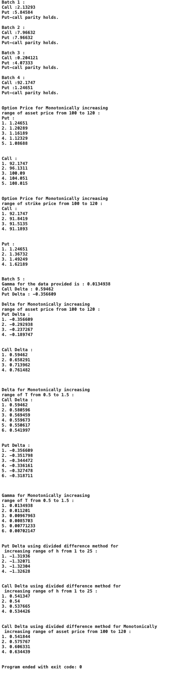
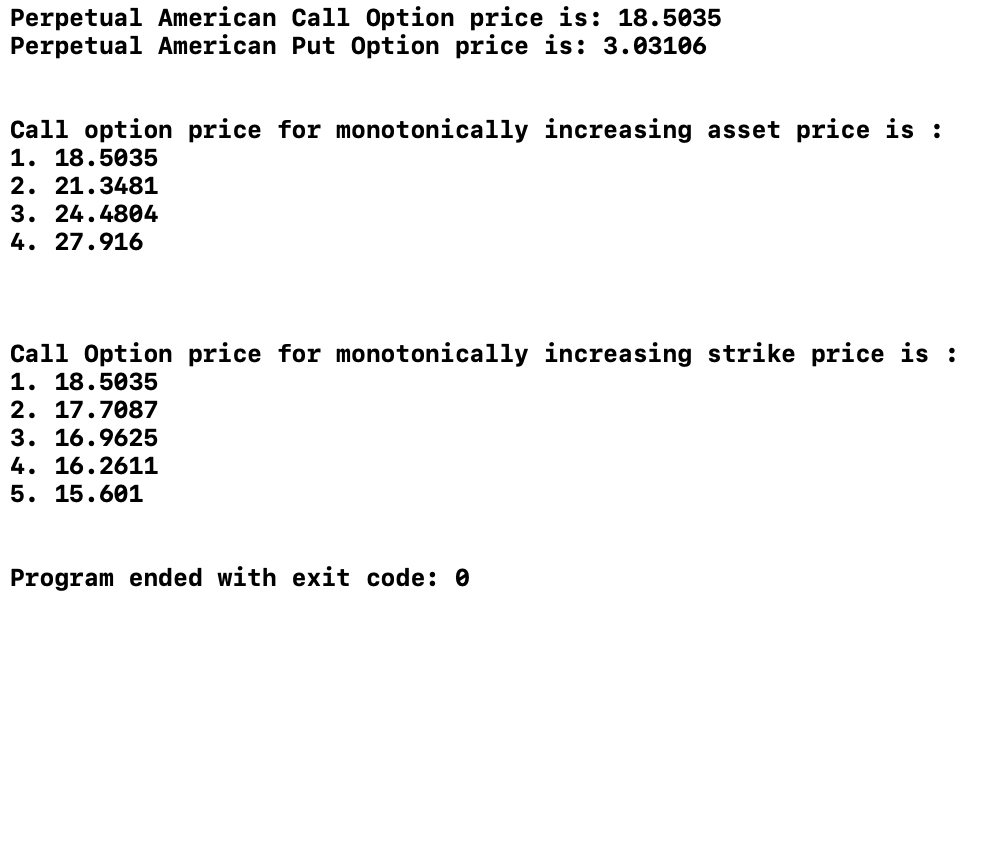

# Option-Pricing-Models-Outputs

## Table of Contents

- [Overview](#overview)
- [Models and Outputs](#models-and-outputs)
  - [European Option](#european-option)
  - [Perpetual American Option](#perpetual-american-option)
- [Contributing](#contributing)
- [Contact](#contact)

## Overview

This repository contains implementations and outputs for various option pricing models, including European and Perpetual American options. The codebase is designed to serve as a comprehensive toolkit for financial analysts, quants, and anyone interested in option pricing.

## Models and Outputs

### European Option

The European Option model uses the Black-Scholes formula for pricing and includes sensitivity calculations like Delta and Gamma.

#### Output

### Perpetual American Option

The Perpetual American Option model focuses on pricing calculations based on specific financial parameters.

#### Output

## Contributing

Feel free to fork the project and submit a pull request with your changes!

## Contact

- GitHub: [@dp2056](https://github.com/dp2056)
- LinkedIn: [Darshan Parvadiya](https://www.linkedin.com/in/dparvadiya)
- Email: darshan.parvadiya.2024@anderson.ucla.edu
